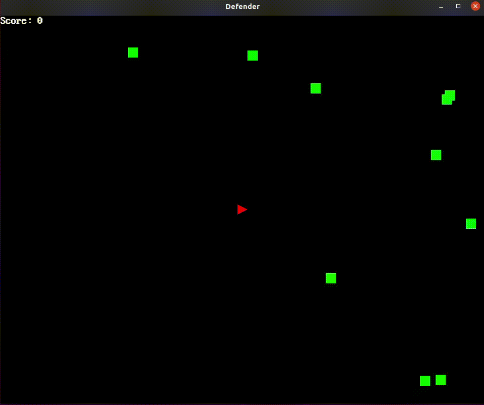

# defender-rust
A simple 2-D shooter game written in Rust to learn Rust.

Inspired by: [Blog post by Andrew Huynh](https://a5huynh.github.io/posts/2018/adventures-in-rust/)

### Controls

Key         | Action
------------|--------------------------------
Arrow keys  | Move space ship.
Space       | Fire bullets.
Enter       | Restart game if you died/won.
Esc         | Exit the game.
